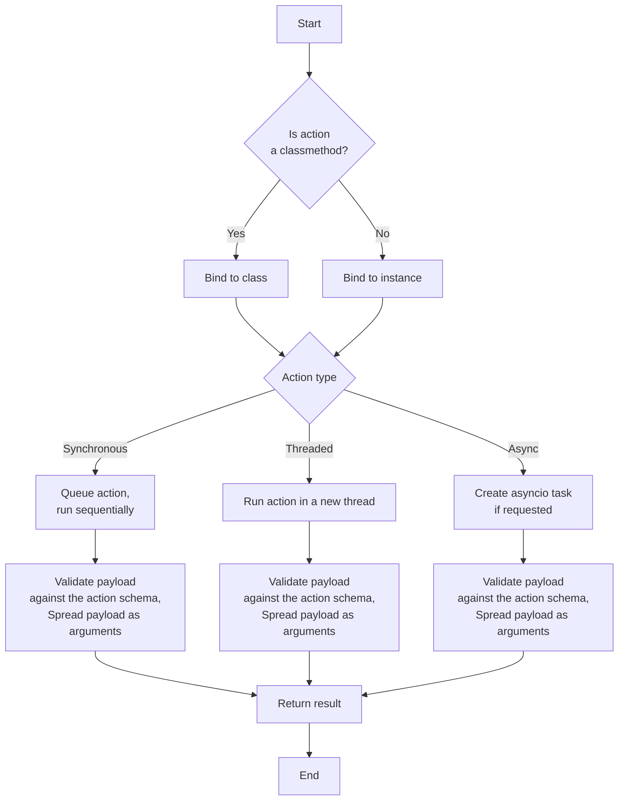

# Action Descriptors

This document summarizes the API possibilities of action descriptors that one may wish to support in an IoT runtime:

## Payload Validation

By default, when there is no input schema defined, the payload is not validated. This means one can pass any payload without validation.
This is useful for quick prototyping, or when the action does not require strict input validation, or if the user is a beginner.

The most expressive way to define payload validation to use type annotations in the action method signature:

```python
class Picoscope(Thing):

    @action()
    def run_block(self, 
            pre_trigger_samples: int, 
            post_trigger_samples: int, 
            timebase: int,
            oversample: int = 0, 
            seg_index: int = 0
        ) -> float:
        """Run a single block capture on the Picoscope device"""
        time_indisposed = ct.c_int32()
        self._status['run-block'] = ps.ps6000RunBlock(self._ct_handle,
            pre_trigger_samples, post_trigger_samples, timebase, oversample,
            ct.byref(time_indisposed), seg_index, None, None)
        assert_pico_ok(self._status['run-block'])
        return time_indisposed.value
```

If one generates the Thing Model fragment for the action, the `input` (schema) field will be defined:

```python
Picoscope.run_block.to_affordance()
```

```json
{
    "run_block": {
        "title": "run_block",
        "description": "Run a single block capture on the Picoscope device",
        "input": {
            "type": "object",
            "properties": {
                "pre_trigger_samples": {
                    "type": "integer"
                },
                "post_trigger_samples": {
                    "type": "integer"
                },
                "timebase": {
                    "type": "integer"
                },
                "oversample": {
                    "type": "integer",
                    "default": 0
                },
                "seg_index": {
                    "type": "integer",
                    "default": 0
                }
            },
            "required": [
                "pre_trigger_samples",
                "post_trigger_samples",
                "timebase"
            ]
        },
        "output": {
            "type": "number"
        }
    }
}
```

This type of validation is made possible by constructing a pydantic model from the type annotations.

For more complex payload validation, one can use JSON schema or pydantic models (directly).

=== "JSON Schema"

    ```python   
    ```

=== "Pydantic Model"

    ```python
    ```

The output payload is not validated.

## Execution Control

Execution control of operations (like `invokeAction`) can be offered in three different ways:

- synchronous - queued one after another, default behaviour of **both** properties and actions
    - `Thing` object is not manipulated simultaneously by multiple operations in multiple threads by a remote client, its a fundamental assumption based on the OOP paradigm
    - prevents incompatible physical actions in the world from running at the same time on the same device
    - maximizes thread safety increasing suitability of runtime for hardware engineers
- threaded actions
    - not queued, runs immediately when action is called
    - allows multiple actions to run simultaneously
    - suitable for long running actions
- async
    - create an asyncio task in the current event loop
    - OR, multiple async actions from multiple `Things` can be run in parallel (in which case, per `Thing`, the actions are still queued)



This scheduling control may need to be implemented in a separate RPC layer or similar. See the [ZMQ RPC layer](zmq.md) for more details.


