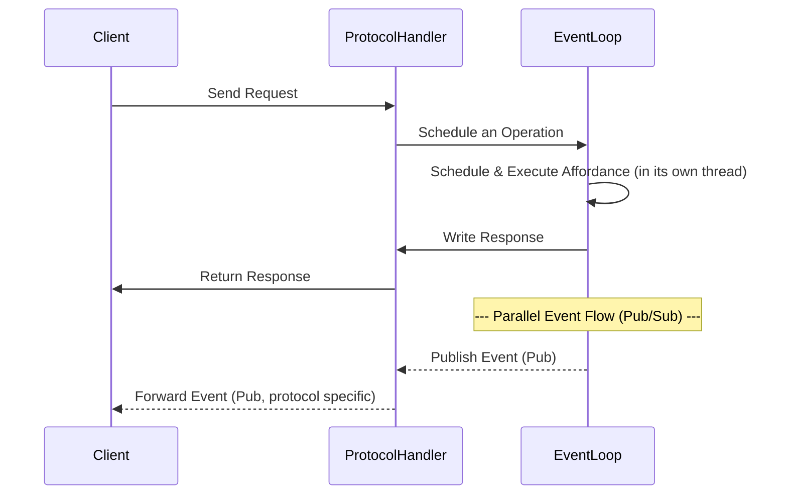

# Event Loop

The main purpose of the [`EventLoop`](../api-reference/eventloop/) is to:

- add scheduling control for the interaction affordances
- decouple protocol handlers from the actual execution of the interaction affordances
- unify execution across multiple protocols
- maintain standardized behaviour irrespective of the protocol, for example, pushing an event must cause both a HTTP and a MQTT client to receive the same event

Three types of scheduling are supported:

- **Synchronous** – the default, blocking until the interaction affordance is completed.
- **Async** – non-blocking and can be scheduled on the current async loop.
- **Threaded** – non-blocking and can be scheduled on a separate thread.

All supported protocols retrieve information from their request object, which is used to create an [`Operation`](../api-reference/eventloop/operation.md). The `EventLoop` is invoked with the `Operation`, which handles the scheduling and execution of the interaction affordance. The response is sent back to the protocol handler, which returns the response to the client:

