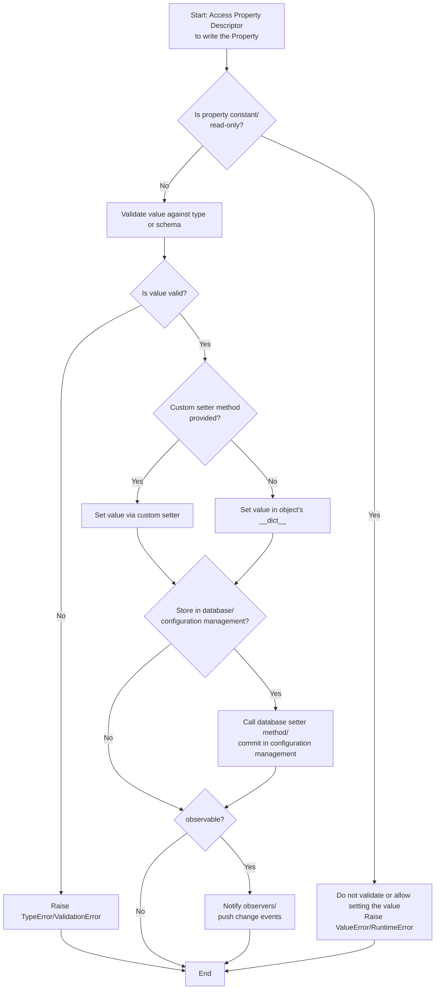
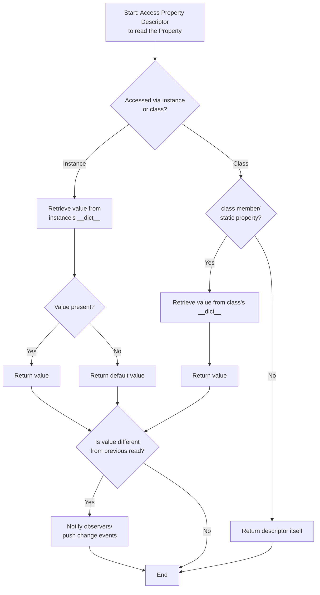

# Property Descriptors

This document summarizes the API possibilities of property descriptors that one may wish to support in an IoT runtime:

## Typed Properties

Apart from a base `Property` descriptor, one could support typed properties corresponding to well known data types. The intention would be two fold:

- expressive definitions of properties, suitable for beginners
- support highly specific parameters with a descriptive `__init__` method that would be picked up by IDEs

For example:

=== "String, Number & Boolean"

    ```python linenums="1"
    class Spectrometer(Thing):
        """class doc"""

        serial_number = String(default=None, allow_None=True, regex=r"^(USB|STS)\d{5}$",
                            doc="serial number of the spectrometer to connect/or connected")

        integration_time = Number(default=1000, bounds=(0.001, None), crop_to_bounds=True,
                            doc="integration time of measurement in milliseconds")

        nonlinearity_correction = Boolean(default=True,
                            doc="apply nonlinearity correction to the data")
    ```

=== "List, Iterables"

    ```python linenums="1"
    class Spectrometer(Thing):
        """class doc"""

        wavelengths = List(item_type=float, default=None, allow_None=True,
                        doc="list of wavelengths in nm to measure")

        calibration_coefficients = Tuple(default=(1.0, 2.0), item_type=float, accept_list=True,
                        doc="calibration coefficients for the spectrometer")
    ```

=== "Objects"

    ```python linenums="1"
    class Spectrometer(Thing):
        """class doc"""

        spectrum = ClassSelector(default=None, class_=numpy.ndarray, # or any other class
                    doc="detector class to use for the spectrometer") # type: numpy.ndarray

        spectrum_history = ClassSelector(default=None, class_=pandas.DataFrame,
                    doc="history of spectra as a pandas DataFrame with columns \
                        'timestamp' and 'data'") # type: pandas.DataFrame

        spectrum_custom = NDArray(default=None, shape=(1024, 2), dtype=float,
                    doc="custom property that defines numpy parameters in __init__") # type: numpy.ndarray
    ```

See list of predefined types [here](../beginners-guide/articles/properties/index.md#predefined-typed-properties).

## Schema Constrained Properties

Further, for advanced users, one could support JSON schema and pydantic models to define complex data structures. An example could be as follows:

=== "JSON Schema"

    ```python linenums="1"
    trigger_schema = dict(
        type='object',
        properties=dict(
            enabled=dict(type='boolean'),
            channel=dict(
                type='string',
                enum=['A', 'B', 'C', 'D', 'EXTERNAL', 'AUX']
                # include both external and aux for 5000 & 6000 series
                # let the device driver check if the channel is valid for the series
            ),
            threshold=dict(type='number'),
            adc=dict(type='boolean'),
            direction=dict(
                type='string',
                enum=['above', 'below', 'rising', 'falling', 'rising_or_falling']
            ),
            delay=dict(type='integer'),
            auto_trigger=dict(
                type='integer',
                minimum=0
            )
        ),
        required=['enabled', 'channel', 'threshold', 'direction'],
        description="Trigger settings for a single channel of the picoscope",
    )

    class Picoscope(Thing):

        trigger = Property(doc="Trigger settings",
                        model=trigger_schema) # type: dict

        # option 1, accept the entire dictionary as input
        @trigger.setter
        def set_trigger(self, **value: dict) -> None:
            channel = value["channel"].upper()
            direction = value["direction"].upper()
            enabled = ctypes.c_int16(int(value["enabled"]))
            delay = ctypes.c_int32(value["delay"])
            direction = ps.PS6000_THRESHOLD_DIRECTION[f'PS6000_{direction}']
            if channel in ['A', 'B', 'C', 'D']:
                channel = ps.PS6000_CHANNEL['PS6000_CHANNEL_{}'.format(
                                            channel)]
            else:
                channel = ps.PS6000_CHANNEL['PS6000_TRIGGER_AUX']
            if not value["adc"]:
                if channel in ['A', 'B', 'C', 'D']:
                    threshold = int(threshold * self.max_adc * 1e3
                                / self.ranges[self.channel_settings[channel]['v_range']])
                else:
                    threshold = int(self.max_adc/5)
            threshold = ctypes.c_int16(threshold)
            auto_trigger = ctypes.c_int16(int(auto_trigger))
            self._status['trigger'] = ps.ps6000SetSimpleTrigger(self._ct_handle,
                                        enabled, channel, threshold, direction,
                                        delay, auto_trigger)
            assert_pico_ok(self._status['trigger'])

        # option 2, spread the parameters of the setters so that its more explicit
        @trigger.setter
        def set_trigger(self, enabled: bool, channel: str, threshold: float,
                    adc: bool = True, direction: str = 'rising', delay: int = 0,
                    auto_trigger: float = 0) -> None:
            ...
    ```

=== "Pydantic Models"

    ```python linenums="1"
    class Rect(BaseModel):
        x: Annotated[int, Field(default=0, ge=0)]
        y: Annotated[int, Field(default=0, ge=0)]
        width: Annotated[int, Field(default=0, gt=0)]
        height: Annotated[int, Field(default=0, gt=0)]

        def to_ueye_rect(self) -> ueye.IS_RECT:
            """Convert to ueye.IS_RECT object"""
            rect = ueye.IS_RECT()
            rect.s32X = ueye.int(self.x)
            rect.s32Y = ueye.int(self.y)
            rect.s32Width = ueye.int(self.width)
            rect.s32Height = ueye.int(self.height)
            return rect


    class UEyeCamera(Thing):

        def get_aoi(self) -> Rect:
            """Get current AOI from camera as Rect object (with x, y, width, height)"""
            rect_aoi = ueye.IS_RECT()
            ret = ueye.is_AOI(self.handle, ueye.IS_AOI_IMAGE_GET_AOI,
                            rect_aoi, ueye.sizeof(rect_aoi))
            assert return_code_OK(self.handle, ret)
            return Rect(
                    x=rect_aoi.s32X.value,
                    y=rect_aoi.s32Y.value,
                    width=rect_aoi.s32Width.value,
                    height=rect_aoi.s32Height.value
                )

        def set_aoi(self, value: Rect) -> None:
            """Set camera AOI. Specify as x,y,width,height or a tuple
            (x, y, width, height) or as Rect object."""
            rect_aoi = value.to_ueye_rect()
            ret = ueye.is_AOI(self.handle, ueye.IS_AOI_IMAGE_SET_AOI,
                                rect_aoi, ueye.sizeof(rect_aoi))
            assert return_code_OK(self.handle, ret)

        AOI = Property(fget=get_aoi, fset=set_aoi, model=Rect,
                    doc="Area of interest within the image") # type: Rect
    ```

## Optional Getters and Setters

A `Property` must be able to be defined without a getter or setter. Getters and setters only need to be defined if one needs to override the default behavior,
or when applying the value directly onto the hardware. This reduces boilerplate code.

```python linenums="1"
class UEyeCamera(Thing):

    # property with no getter or setter needed
    serial_number = String(default=None, allow_None=True, regex=r"^[1-9]\d{7}$",
        doc="serial number of the camera to connect") # type: str

    def __init__(self, serial_number: str = None):
        super().__init__()
        self.serial_number = serial_number
        # A container for the serial number is autocreated in the instance's __dict__.
        # serial number is used to search for the device, not to set on it.

    # property with getter and setter that interacts with the hardware
    def get_aoi(self) -> Rect:
        """Get current AOI from camera as Rect object (with x, y, width, height)"""
        ...

    def set_aoi(self, value: Rect) -> None:
        """Set camera AOI. Specify as x,y,width,height or a tuple"""
        ...

    AOI = Property(fget=get_aoi, fset=set_aoi, model=Rect,
                doc="Area of interest within the image") # type: Rect
```

## Sequence of Access

A summary of the sequence of access for a property descriptor is as follows:

`setter`:



`getter`:



#### Observables

By setting the `observable` argument to `True`, the property automatically pushes change events to clients.

- for readonly properties, a change event is pushed when the read value differes from the previous read value.
- for writable properties, a change event is pushed when the value is set successfully and differs from the the previous set or read value (this may need to be optimized as it could lead to duplicate notifications).

Apart from that, `param`'s watchers are technically supported (but **disabled for time being**). A local observer can be implmented as follows:

```python
import param # hololinked's Property descriptor machinery is based on param

class DCPowerSupply(Thing):

    voltage = Property(model=float, default=0.0, min=0, max=30, observable=True,
        description="Voltage set point of the power supply.")

    @param.depends('voltage')
    def _on_voltage_change(self):
        """Local observer for voltage property change."""
        # do custom post set logic here
        print(f"Voltage changed to {self.voltage}") # placeholder
```
