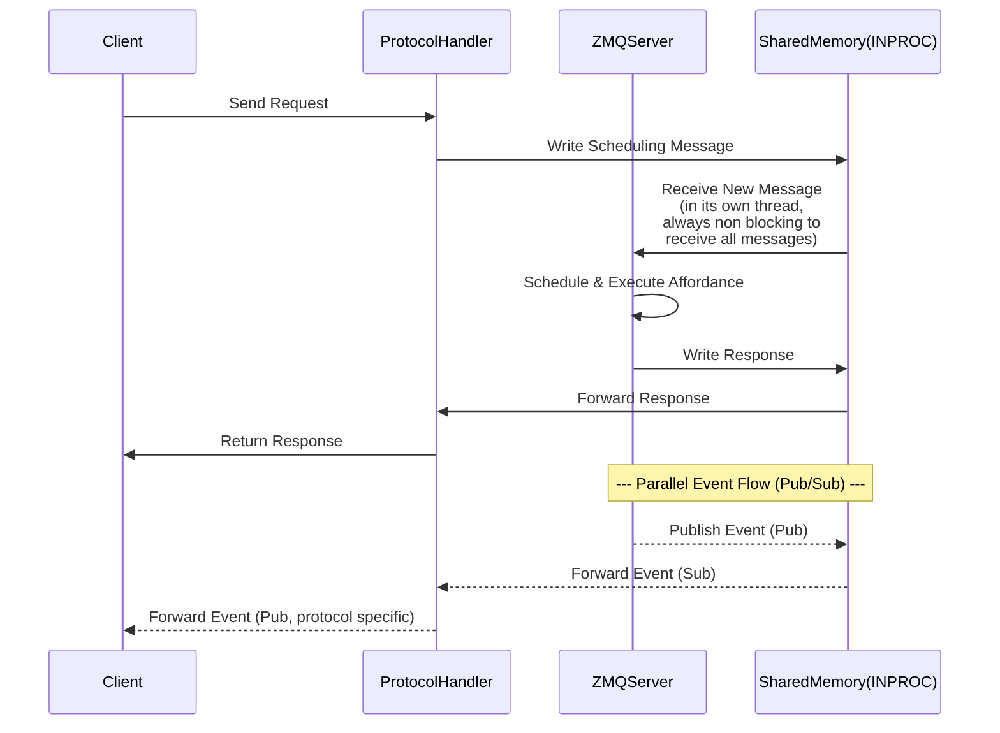

# ZMQ RPC Broker

The main purpose of the RPC broker is to:

- add scheduling control for the interaction affordances
- decouple protocol handlers (a.k.a controllers) from the actual execution of the interaction affordances
- unify execution control across multiple protocols
- maintain standardized behaviour irrespective of the protocol, for example, pushing an event must cause both the HTTP and MQTT clients to receive the same event

Three types of scheduling are supported:

- **Synchronous** – the default, blocking until the interaction affordance is completed.
- **Async** – non-blocking and can be scheduled on the current async loop.
- **Threaded** – non-blocking and can be scheduled on a separate thread.

All supported protocols retrieve information from their request object, which is used to create a scheduling message. The message is then sent to the ZMQ RPC Broker, which handles the scheduling and execution of the interaction affordance. The ZMQ server then sends the response back to the protocol handler, which returns the response to the client:



In a certain way, this is definitely a protocol-to-protocol transfer of request and response, with a minor difference that ZMQ handles this over its `INPROC` transport over threads & shared memory, which is significantly more efficient than TCP-to-TCP communication.

The scheduling message is a simple JSON object, tailored to arbitrary serialization and ZMQ multipart messaging scheme:

=== "Request Message"

    ```json
    {
        "type": "object",
        "$schema": "http://json-schema.org/draft-07/schema#",
        "description": "header of the message",
        "properties": {
            "senderID" : {
                "type": "string",
                "description": "id of the sender of the message"
            },
            "receiverID" : {
                "type": "string",
                "description": "id of the receiver of the message"
            },
            "messageType" : {
                "type": "string",
                "description": "type of the message being sent",
                "enum": [
                    "HANDSHAKE", "OPERATION", "EXIT", "INTERRUPT"
                ]
            },
            "messageID" : {
                "type": "string",
                "format": "uuid",
                "description": "unique id of the message to correlate with the response"
            },
            "serverExecutionContext" : {
                "type": "object",
                "description": "activities to be taken care by the server while performing the operation",
                "properties": {
                    "oneway": {
                        "type": "boolean"
                    },
                    "invokationTimeout": {
                        "type": "number",
                        "minimum": 0
                    },
                    "executionTimeout": {
                        "type": "number",
                        "minimum": 0
                    }
                }
            },
            "thingID" : {
                "type": "string",
                "description": "id of the thing on which the operation is to be performed"
            },
            "object" : {
                "type": "string",
                "description" : "a property, action or event - object of the thing on which the operation is to be performed"
            },
            "operation" : {
                "type": "string",
                "description" : "name of the peration to be performed",
                "enum" : [
                    "readProperty", "writeProperty", "invokeAction", "subscribeEvent",
                    "unsubscribeEvent", "readMultipleProperties", "writeMultipleProperties"
                ]
            },
            "payloadContentType" : {
                "type": "string",
                "description" : "content type of the payload",
                "enum" : [
                    "application/json", "pickle", "x-msgpack", "text", "text/plain"
                ]
            },
            "preencodedPayloadContentType" : {
                "type": "string",
                "description" : "content type of the pre-encoded payload"
            },
            "thingExecutionContext" : {
                "type": "object",
                "description" : "thing execution context while performing the operation",
                "properties" : {
                    "fetchExecutionLogs" : {
                        "type" : "boolean"
                    }
                }
            }
        },
        "required": ["messageType", "messageID", "serverExecutionContext"]
    }
    ```

=== "Response Message"

    ```json
    {
        "type": "object",
        "$schema": "http://json-schema.org/draft-07/schema#",
        "properties" : {
            "messageID" : {
                "type": "string",
                "format": "uuid",
                "description": "unique id of the message to correlate with the request"
            },
            "messageType" : {
                "type": "string",
                "description": "type of the message",
                "enum": ["REPLY", "ERROR", "TIMEOUT",
                        "INVALID_MESSAGE", "EVENT_DISCONNECTED"]
            },
            "payloadContentType" : {
                "type": "string",
                "description" : "content type of the payload",
                "enum" : [
                    "application/json", "pickle", "x-msgpack", "text", "text/plain"
                ]
            },
            "preencodedPayloadContentType" : {
                "type": "string",
                "description" : "content type of the pre-encoded payload"
            }
        },
        "required": ["messageType", "messageID"]
    }
    ```
